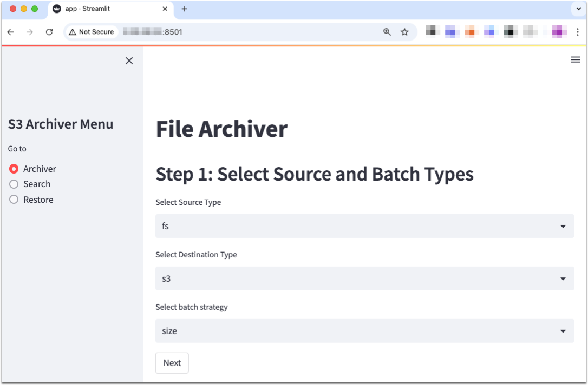
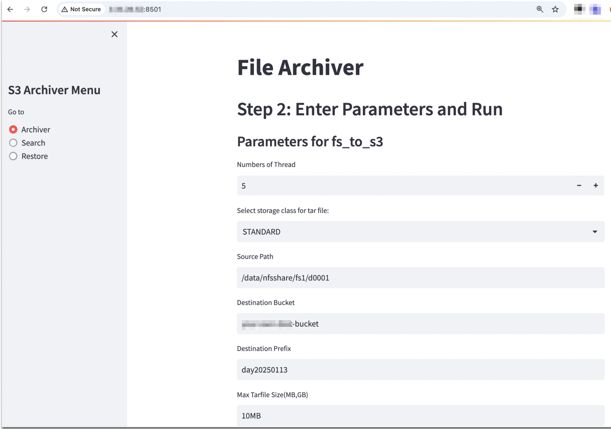
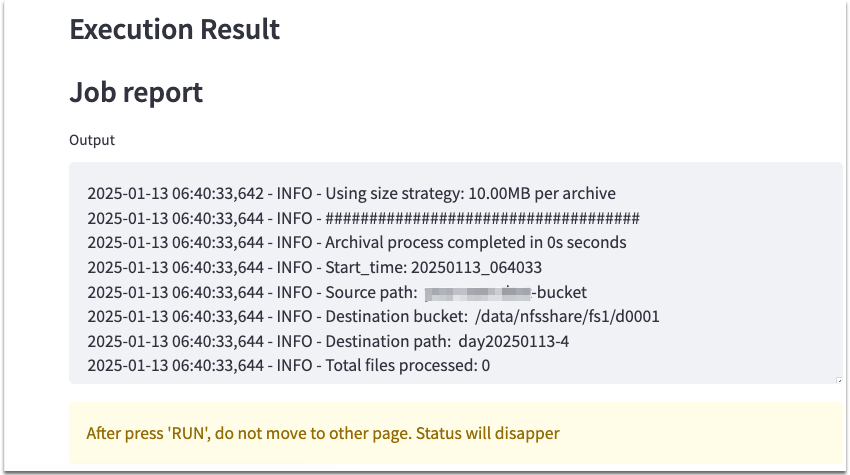
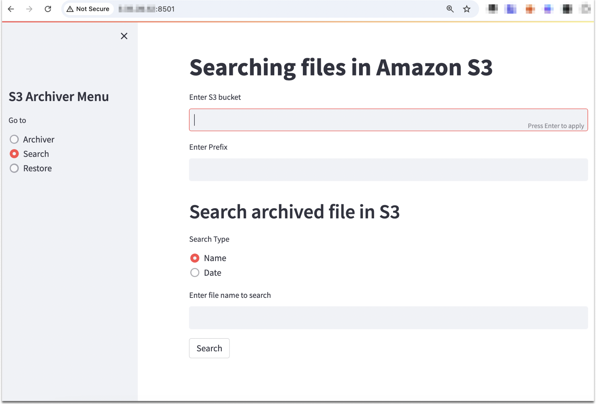
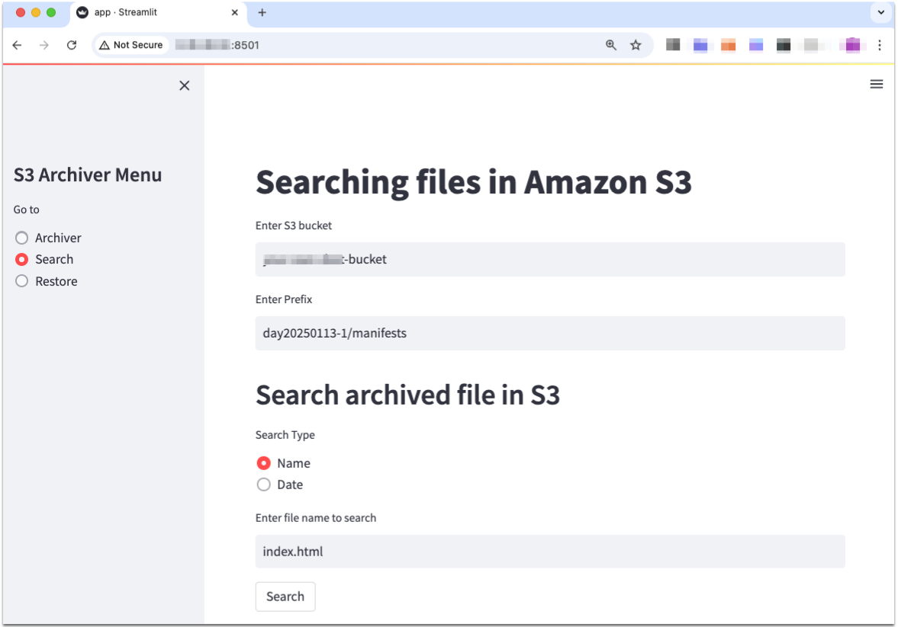
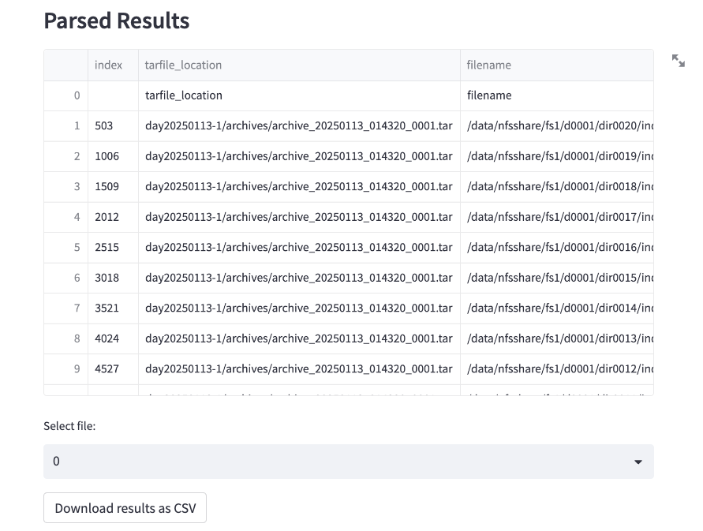
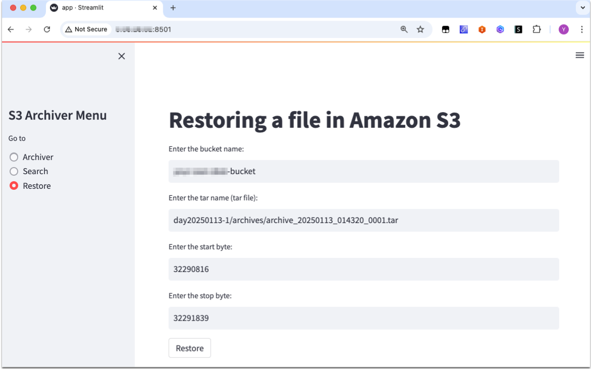
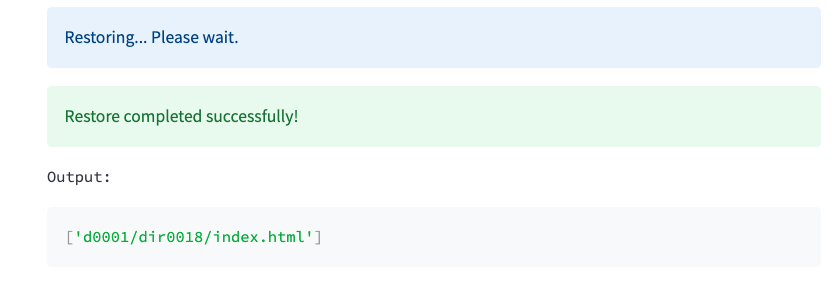

# Small Files Archiving Solution
## Change Log
- 2025.01.13: v2 released
  - Support GUI based operation
- 2024.02.25: v1 released

## What is __small file archiving solution__?
__small file archiving solution__ is aimed to transfer millions of files into Amazon S3 efficiently aggregating small files into big tarfiles. This application supports not only trasnferring but also searching original file and restore it individually. This feature will help user reduce cloud storage cost reducing PUT request cost, and transfer to cloud faster than transferring original files.
The codes of this solution are developed by me and __Amazon Q Developer__. 

### Features
- Aggregating files on on-premises storage, and generating tarfiles and uploading to S3 directly
- Providing manifest files which is including tarfile, subset file, date, file size, first block, last block, md5
- Finding tarfiles which includes specific subset file by condition, such as filename, date range.
- Retrieving subset file itself from a tarfile in S3 using [byte-range](https://docs.aws.amazon.com/whitepapers/latest/s3-optimizing-performance-best-practices/use-byte-range-fetches.html)
- Generating tarfiles from input file, instead of scanning filesystem
- GUI based operation, which is based on streamlit

## Pre-requsites
- linux
- python >= 3.7
- streamlit
- [aws cli](https://docs.aws.amazon.com/cli/latest/userguide/cli-configure-files.html)
- _aws configure_ to access Amazon S3

## Installing
- Clone github repository
```bash
git clone https://github.com/aws-samples/small-files-archiving-solution.git
cd small-files-archiving-solution/current
```

- Install required packages:
```bash
pip install -r requirements.txt
```

## Running an application
- To run the application, use the following command:

```bash
streamlit run app.py --server.fileWatcherType none
```
or

```bash
./run-app.sh
```
After running a script, you will see url address to access, then open this url on your web broswer.

## Using an application
### Archiving
1. Select "Archiver" from the sidebar.

2. Choose the source type and batch strategy, then click the "Next" button.
  - source type: supports __filesystem__ or __S3__
  - destination type: supports __S3__
  - batch stragegy:
    - size: __size__ strategy means that tarfile will be generated by specified size.
    - count: __count__ strategy means that tarfile will be generated based on specified original file numbers.


3. Enter the required parameters and click the "Run" button to start archiving.
  - Numbers of Thread: This parameter specifies the number of threads to be used for the archiving process. More threads can speed up the process by performing multiple operations in parallel, but it also requires more system resources.
  - Storage Classes: This is the destination S3 Storage class where tar files are stored
  - Source Path: This is the path to the source directory or file system from which the files will be archived. It is used when the source type is a file system
  - Destination Bucket: This is the name of the S3 bucket where the archived files will be stored. It is required for both file system to S3 (fs_to_s3) and S3 to S3
  - Destination Prefix: This is the prefix (or folder path) within the destination S3 bucket where the archived files will be stored. It helps in organizing the files within the bucket.
  - Max Tarfile Size(MB,GB): This parameter specifies the maximum size of each tar file created during the archiving process. It can be specified in units like MB (Megabytes) or GB (Gigabytes). This helps in managing the size of the archived files and ensures they do not exceed a certain limit.

4. Confirm the result

  - navigate s3 console to destination bucket and prefix.
  - confirm new prefix for archived files and manifests files
```bash
ec2-user@ip v2% aws s3 ls s3://your-dst-bucket/day20250123/
                           PRE archives/
                           PRE manifests/
```
  - confirm tarfiles in __archives__ prefix
```bash
ec2-user@ip v2% aws s3 ls s3://your-dst-bucket/day20250123/archives/ 
2025-01-13 17:06:21   10895360 archive_20250113_080619_0001.tar
2025-01-13 17:06:21   10885120 archive_20250113_080619_0002.tar
2025-01-13 17:06:20   10905600 archive_20250113_080619_0003.tar
2025-01-13 17:06:21   10895360 archive_20250113_080619_0004.tar
2025-01-13 17:06:21   10895360 archive_20250113_080619_0005.tar
2025-01-13 17:06:22   10905600 archive_20250113_080619_0006.tar
2025-01-13 17:06:22   10885120 archive_20250113_080619_0007.tar
2025-01-13 17:06:22   10915840 archive_20250113_080619_0008.tar
2025-01-13 17:06:22   10885120 archive_20250113_080619_0009.tar
2025-01-13 17:06:22   10885120 archive_20250113_080619_0010.tar
2025-01-13 17:06:23   10946560 archive_20250113_080619_0011.tar
2025-01-13 17:06:23   10905600 archive_20250113_080619_0012.tar
2025-01-13 17:06:23   10926080 archive_20250113_080619_0013.tar
2025-01-13 17:06:23   10885120 archive_20250113_080619_0014.tar
2025-01-13 17:06:23   10874880 archive_20250113_080619_0015.tar
2025-01-13 17:06:24   10915840 archive_20250113_080619_0016.tar
2025-01-13 17:06:24   10905600 archive_20250113_080619_0017.tar
2025-01-13 17:06:24   10895360 archive_20250113_080619_0018.tar
2025-01-13 17:06:24   10895360 archive_20250113_080619_0019.tar
2025-01-13 17:06:24    4935680 archive_20250113_080619_0020.tar
```
  - confirm manifest files in __manifests__ prefix
```bash
ec2-user@ip v2% aws s3 ls s3://your-dst-bucket/day20250123/manifests/ 
2025-01-13 17:06:21      84191 manifest_20250113_080619_0001.csv
2025-01-13 17:06:21      82740 manifest_20250113_080619_0002.csv
2025-01-13 17:06:21      82755 manifest_20250113_080619_0003.csv
2025-01-13 17:06:21      83878 manifest_20250113_080619_0004.csv
2025-01-13 17:06:21      82590 manifest_20250113_080619_0005.csv
2025-01-13 17:06:23      86792 manifest_20250113_080619_0006.csv
2025-01-13 17:06:23      80970 manifest_20250113_080619_0007.csv
2025-01-13 17:06:23      85648 manifest_20250113_080619_0008.csv
2025-01-13 17:06:22      81118 manifest_20250113_080619_0009.csv
2025-01-13 17:06:23      81145 manifest_20250113_080619_0010.csv
2025-01-13 17:06:24      89525 manifest_20250113_080619_0011.csv
2025-01-13 17:06:24      84372 manifest_20250113_080619_0012.csv
2025-01-13 17:06:24      86457 manifest_20250113_080619_0013.csv
2025-01-13 17:06:24      81787 manifest_20250113_080619_0014.csv
2025-01-13 17:06:24      82103 manifest_20250113_080619_0015.csv
2025-01-13 17:06:24      84048 manifest_20250113_080619_0016.csv
2025-01-13 17:06:25      85186 manifest_20250113_080619_0017.csv
2025-01-13 17:06:25      82892 manifest_20250113_080619_0018.csv
2025-01-13 17:06:25      82963 manifest_20250113_080619_0019.csv
2025-01-13 17:06:24      38798 manifest_20250113_080619_0020.csv

```

#### Logs
Whenever archiving program runs, it generate logfile under __logs__ /__{dst_prefix}__ directory. With this logs, you can find out errors, result messages.

### Searching
1. Select "Search" from the sidebar.

2. Enter the S3 bucket name and prefix.
  - bucket name: Destination bucket
  - prefix: Prefix which contains manifest of destination bucket.
3. Enter the search type and value, then click the "Search" button.
__Search__ feature supports 2 types; by name, and by duration.

4. Confirm query result

5. In __Select file__ lists, click the item which you would like to restore, then required parameters would be filled automatically when you select __Restore__ menu in sidebar.

### Restoring
1. Select "Restore" from the sidebar.
2. Enter the required parameters and click the "Restore" button to start restoring.
You can find required parameters from __Search__ result.

  - Enter the bucket name: bucket name where the archived files is stored.
  - Enter the tar name (tar file): tarfile which contains a file which you're looking for.
  - Enter the start byte: start byte position in tarfile
  - Enter the stop byte: end byte position in tarfile
3. Confirm file is restored


- access streamlit workstation
- find restored file in $git_repo/v2/restored_data directory
```bash
[ec2-user@ip v2]$ ls -l restored_data/d0001/dir0018/index.html
-rw-rw-r-- 1 ec2-user ec2-user 44 Dec 30  2019 restored_data/d0001/dir0018/index.html
```

### Using Shell
Instead of streamlit application, you can use shell command.
```bash
[ec2-user@ip v2]$ ls -l shell
total 12
-rw-r--r-- 1 ec2-user ec2-user 1830 Jan 10 10:04 run-archiver.sh
-rw-rw-r-- 1 ec2-user ec2-user  209 Dec 27 01:30 run-restore.sh
-rw-rw-r-- 1 ec2-user ec2-user  385 Dec 27 01:31 run-search.sh
```

## Performance comparison
*To be updated soon*

## Conclusion
Small file archiving solution is built to provide efficient way of archiving small file on Amazon S3. Combing small files into big TAR file can help customer reduce PUT request cost and monitoring cost, and storing data in Amazon S3 Intelligent Tiering help customer save storage cost specially for long-term archiving data. With this solution, customer can search and restore specific file when he needs to retrieve it.

## Security
See [CONTRIBUTING](CONTRIBUTING.md#security-issue-notifications) for more information.
## License
This library is licensed under the MIT-0 License. See the LICENSE file.
